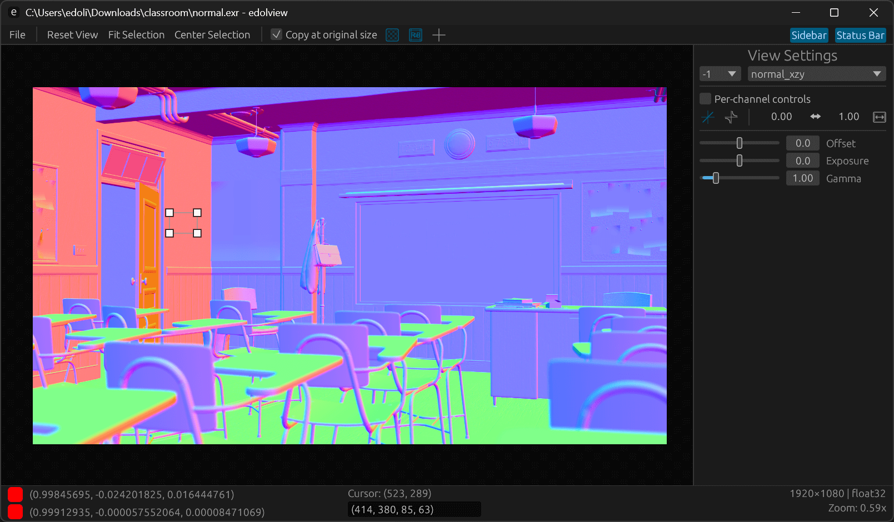

# EdolView - Image Viewer for Visualization and Analysis

A lightning-fast, versatile image viewer 🚀
Designed for researchers, engineers, and graphics professionals who need **speed, flexibility, and powerful visualization**.


* ⚡ **Blazing Fast Startup & I/O**: Instant starts up and rapid image loading without delays
* 📂 **Wide Format Support**: Open and explore all major research and [graphics formats](#supported-file-formats)
* 🎨 **Colormap Visualization**: Go beyond raw images with rich colormap-based data visualization
* 🔧 **Flexible Display Controls**: Fine-tune normalization, exposure, gamma, and offset with ease



## Installation

- __Windows__: [edolview-windows.zip](https://github.com/edoli/edolview-rs/releases/latest/download/edolview-windows.zip)
- __Linux__:  [edolview-mac.zip](https://github.com/edoli/edolview-rs/releases/latest/download/edolview-mac.zip)
- __macOS__: [edolview-linux.zip](https://github.com/edoli/edolview-rs/releases/latest/download/edolview-linux.zip)

## Usage

### Shortcuts

* **Navigation**
  * `←` / `→` : navigate image files in current directory
  * `+` / `-`, `scroll` : zoom in / out
  * `r` : reset view
  * `f11` : fullscreen mode

* **Selection**
  * `ctrl` + `a` : Select all region
  * `esc` : Deselect region
  * `ctrl` + `d` : Copy selected region


## How to Build

The project is Rust-based and links to **OpenCV 4.12.0 (static)** with a minimal module set (`core,imgproc,imgcodecs`) and **OpenEXR** enabled.

### 0) Prerequisites (all platforms)
* Rust
* CMake, LLVM/Clang
* curl, unzip, pkg-config (Linux/macOS)
* Git


### 1) Install Rust

**Linux / macOS**

```bash
# installs rustup + stable toolchain
curl --proto '=https' --tlsv1.2 -sSf https://sh.rustup.rs | sh
# then reload shell or:
source "$HOME/.cargo/env"

# Check installation
rustc -V && cargo -V
```

**Windows (PowerShell)**

```powershell
# Option A: winget
winget install Rustlang.Rustup

# Option B: official installer
# https://win.rustup.rs/x86_64 (downloads rustup-init.exe)

# Check installation
rustc -V; cargo -V
```

### 2) Prepare OpenCV

**Linux (Ubuntu)**

```bash
sudo apt-get update
sudo apt-get install -y --no-install-recommends \
  build-essential cmake git curl unzip pkg-config \
  clang libclang-dev llvm-dev

export OPENCV_VERSION=4.12.0
WORKDIR="$(pwd)/.opencv"; SRC="$WORKDIR/opencv-$OPENCV_VERSION"; INSTALL="$WORKDIR/install"
mkdir -p "$WORKDIR" && cd "$WORKDIR"
[ -d "$SRC" ] || (curl -sSL -o opencv.zip https://github.com/opencv/opencv/archive/refs/tags/${OPENCV_VERSION}.zip && unzip -q opencv.zip)
mkdir -p "$SRC/build" && cd "$SRC/build"

cmake \
  -DCMAKE_BUILD_TYPE=Release \
  -DCMAKE_INSTALL_PREFIX="$INSTALL" \
  -DBUILD_LIST=core,imgproc,imgcodecs \
  -DBUILD_TESTS=OFF -DBUILD_PERF_TESTS=OFF -DBUILD_EXAMPLES=OFF \
  -DOPENCV_GENERATE_PKGCONFIG=ON \
  -DBUILD_SHARED_LIBS=OFF -DBUILD_JAVA=OFF -DBUILD_PACKAGE=OFF \
  -DWITH_ADE=OFF -DWITH_FFMPEG=OFF -DWITH_GSTREAMER=OFF \
  -DWITH_IPP=OFF -DWITH_ITT=OFF -DWITH_LAPACK=OFF \
  -DWITH_OPENCL=OFF -DWITH_PROTOBUF=OFF \
  -DOPENCV_IO_FORCE_OPENEXR=ON \
  ..
cmake --build .
cmake --install .

export PKG_CONFIG_PATH="$INSTALL/lib/pkgconfig:${PKG_CONFIG_PATH}"
export OPENCV_PKGCONFIG=1 OPENCV_LINK_STATIC=1 PKG_CONFIG_ALL_STATIC=1
```

**macOS**

```bash
brew update
brew install cmake llvm

export OPENCV_VERSION=4.12.0
WORKDIR="$(pwd)/.opencv"; SRC="$WORKDIR/opencv-$OPENCV_VERSION"; INSTALL="$WORKDIR/install"
mkdir -p "$WORKDIR" && cd "$WORKDIR"
[ -d "$SRC" ] || (curl -sSL -o opencv.zip https://github.com/opencv/opencv/archive/refs/tags/${OPENCV_VERSION}.zip && unzip -q opencv.zip)
mkdir -p "$SRC/build" && cd "$SRC/build"

cmake \
  -DCMAKE_BUILD_TYPE=Release \
  -DCMAKE_INSTALL_PREFIX="$INSTALL" \
  -DBUILD_LIST=core,imgproc,imgcodecs \
  -DBUILD_TESTS=OFF -DBUILD_PERF_TESTS=OFF -DBUILD_EXAMPLES=OFF \
  -DOPENCV_GENERATE_PKGCONFIG=ON \
  -DBUILD_SHARED_LIBS=OFF -DBUILD_JAVA=OFF -DBUILD_PACKAGE=OFF \
  -DWITH_ADE=OFF -DWITH_FFMPEG=OFF -DWITH_GSTREAMER=OFF \
  -DWITH_IPP=OFF -DWITH_ITT=OFF -DWITH_LAPACK=OFF \
  -DWITH_OPENCL=OFF -DWITH_PROTOBUF=OFF \
  -DOPENCV_IO_FORCE_OPENEXR=ON \
  ..
cmake --build .
cmake --install .

export PKG_CONFIG_PATH="$INSTALL/lib/pkgconfig:${PKG_CONFIG_PATH}"
export OPENCV_PKGCONFIG=1 OPENCV_LINK_STATIC=1 PKG_CONFIG_ALL_STATIC=1
```

**Windows (PowerShell)**

```powershell
choco install -y --no-progress llvm cmake ninja git curl unzip

$env:OPENCV_VERSION = "4.12.0"
$work = Join-Path $pwd '.opencv'
$install = Join-Path $work 'install'
$src = Join-Path $work ("opencv-" + $env:OPENCV_VERSION)
New-Item -ItemType Directory -Force -Path $work | Out-Null

if (-not (Test-Path $src)) {
  $zip = Join-Path $work 'opencv.zip'
  curl -L -o $zip "https://github.com/opencv/opencv/archive/refs/tags/$env:OPENCV_VERSION.zip"
  unzip -q $zip -d $work
}
$build = Join-Path $src 'build'
New-Item -ItemType Directory -Force -Path $build | Out-Null
Push-Location $build

cmake `
  "-DCMAKE_BUILD_TYPE=Release" `
  "-DCMAKE_INSTALL_PREFIX=$install" `
  "-DBUILD_LIST=core,imgproc,imgcodecs" `
  "-DBUILD_TESTS=OFF" "-DBUILD_PERF_TESTS=OFF" "-DBUILD_EXAMPLES=OFF" `
  "-DOPENCV_GENERATE_PKGCONFIG=ON" `
  "-DBUILD_SHARED_LIBS=OFF" "-DBUILD_JAVA=OFF" "-DBUILD_PACKAGE=OFF" `
  "-DWITH_ADE=OFF" "-DWITH_FFMPEG=OFF" "-DWITH_GSTREAMER=OFF" `
  "-DWITH_IPP=OFF" "-DWITH_ITT=OFF" "-DWITH_LAPACK=OFF" `
  "-DWITH_OPENCL=OFF" "-DWITH_PROTOBUF=OFF" `
  "-DOPENCV_IO_FORCE_OPENEXR=ON" `
  "-DBUILD_WITH_STATIC_CRT=OFF" `
  ..
cmake --build . --config Release
cmake --install .
Pop-Location

# Optional helpers for linking
$lib = "$install\x64\vc17\staticlib"
$env:OPENCV_LINK_PATHS = $lib
$env:OPENCV_INCLUDE_PATHS = "$install\include"
$env:OPENCV_LINK_STATIC = "1"
```

### 3) Build the viewer

```bash
# from project root
cargo build --release
# or run directly
cargo run
```

**Built executable files path**

* Linux/macOS: `target/release/edolview-rs`
* Windows: `target/release/edolview-rs.exe`

---

### Troubleshooting

* `pkg-config: opencv4 not found` → set `PKG_CONFIG_PATH` to your OpenCV’s `lib/pkgconfig`.
* Windows link errors → ensure `OPENCV_LINK_PATHS`/`OPENCV_INCLUDE_PATHS` point to your static build.
* macOS libclang issues → ensure Homebrew LLVM is on `PATH`, with `LIBCLANG_PATH`/`DYLD_LIBRARY_PATH` set.

## Supported file formats
EdolView internally uses OpenCV for image loading, so image formats supported by OpenCV should be work on EdolView.
* EXR (\*.exr)
* HDR (\*.hdr)
* Flow (\*.flo)
* PFM (\*.pfm)
* PGM (\*.pgm), PPM (\*.ppm)
* JPG (\*.jpg, \*.jpeg)
* PNG (\*.png)
* TIFF (\*.tif, \*.tiff)
* BMP (\*.bmp)
* WEBP (\*.webp)
* GIF (\*.gif)

## License
EdolView is available under the MIT license.