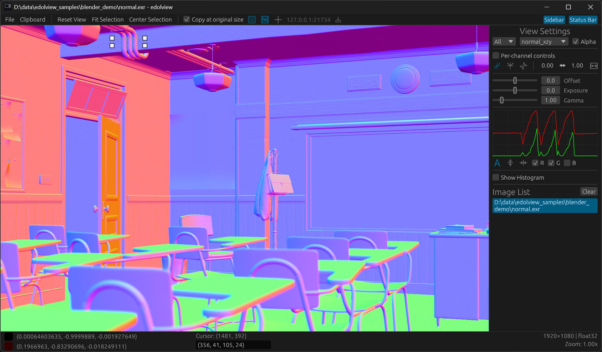

# EdolView - Image Viewer for Visualization and Analysis

A lightning-fast, versatile image viewer 🚀
Designed for researchers, engineers, and graphics professionals who need **speed, flexibility, and powerful visualization**.


* ⚡ **Blazing Fast Startup & I/O**: Instant starts up and rapid image loading without delays
* 📂 **Wide Format Support**: Open and explore all major research and [graphics formats](#supported-file-formats)
* 🎨 **Colormap Visualization**: Go beyond raw images with rich colormap-based data visualization
* 🔧 **Flexible Display Controls**: Fine-tune normalization, exposure, gamma, and offset with ease



## Installation

- __Windows__: [edolview-windows.zip](https://github.com/edoli/edolview-rs/releases/latest/download/edolview-windows.zip)
- __Linux__:  [edolview-mac.zip](https://github.com/edoli/edolview-rs/releases/latest/download/edolview-mac.zip)
- __macOS__: [edolview-linux.zip](https://github.com/edoli/edolview-rs/releases/latest/download/edolview-linux.zip)

## Usage

### Shortcuts

* **Navigation**
  * `←` / `→` : navigate image files in current directory
  * `+` / `-`, `scroll` : zoom in / out
  * `r` : reset view
  * `f11` : fullscreen mode

* **Selection**
  * `shift` + `drag` : Select rectangle region
  * `ctrl` + `a` : Select all region
  * `esc` : Deselect region
  * `ctrl` + `d` : Copy selected region

### Features

* Color maps: **Edolview** supports various color maps. To get more information of color maps, see the wiki page: https://github.com/edoli/edolview-rs/wiki/Color-Map
 
* **Remote Viewer**: **Edolview** can also be controlled remotely over the network. Currently, network protocol is already implemented in [Python](https://pypi.org/project/edolview/) and [VScode extension](https://marketplace.visualstudio.com/items?itemName=edolview-vscode.edolview). Follow the instruction to use network features: [Remote-Viewer](https://github.com/edoli/edolview-rs/wiki/Remote%E2%80%90Viewer).

* **Copy-Paste Selected Region**

https://github.com/user-attachments/assets/fd76159c-da77-4f5d-946c-667cda5c1482

* **Plot Selected Region**

https://github.com/user-attachments/assets/4a219f8b-39f3-48a8-a5ea-b9d610bb3f40


## How to Build

The project is Rust-based and links to **OpenCV 4.12.0 (static)** with a minimal module set (`core,imgproc,imgcodecs`) and **OpenEXR** enabled.

### 0) Prerequisites (all platforms)
* Rust
* CMake, LLVM/Clang
* curl, unzip, pkg-config (Linux/macOS)
* Git


### 1) Install Rust

**Linux / macOS**

```bash
# installs rustup + stable toolchain
curl --proto '=https' --tlsv1.2 -sSf https://sh.rustup.rs | sh
# then reload shell or:
source "$HOME/.cargo/env"

# Check installation
rustc -V && cargo -V
```

**Windows (PowerShell)**

```powershell
# Option A: winget
winget install Rustlang.Rustup

# Option B: official installer
# https://win.rustup.rs/x86_64 (downloads rustup-init.exe)

# Check installation
rustc -V; cargo -V
```

### 2) Prepare OpenCV

**Linux (Ubuntu)**

```bash
sudo apt-get update
sudo apt-get install -y --no-install-recommends \
  build-essential cmake git pkg-config \
  clang libclang-dev llvm-dev nasm

git clone -b release https://github.com/edoli/opencv-edolview.git opencv
cd opencv
sh cmake_script.sh

export PKG_CONFIG_PATH="$(pwd)/../install/lib/pkgconfig:${PKG_CONFIG_PATH}"
export OPENCV_PKGCONFIG=1 OPENCV_LINK_STATIC=1 PKG_CONFIG_ALL_STATIC=1
```

**macOS**

```bash
brew update
brew install cmake llvm git pkg-config nasm

git clone -b release https://github.com/edoli/opencv-edolview.git opencv
cd opencv
sh cmake_script.sh

export PKG_CONFIG_PATH="$(pwd)/../install/lib/pkgconfig:${PKG_CONFIG_PATH}"
export OPENCV_PKGCONFIG=1 OPENCV_LINK_STATIC=1 PKG_CONFIG_ALL_STATIC=1
```

**Windows (PowerShell)**

```powershell
choco install -y --no-progress llvm cmake ninja git nasm

git clone -b release https://github.com/edoli/opencv-edolview.git opencv
Push-Location opencv
pwsh .\cmake_script.ps1

# Optional helpers for linking
$installDir = Join-Path $pwd "..\install"
$libPath = "$installDir\x64\vc17\staticlib"
$libs = Get-ChildItem -Path $libPath -Filter *.lib | ForEach-Object { $_.BaseName }
$libsJoined = $libs -join ","

$env:OPENCV_LINK_LIBS=$libsJoined
$env:OPENCV_LINK_PATHS = $libPath
$env:OPENCV_INCLUDE_PATHS = "$installDir\include"
$env:OPENCV_LINK_STATIC = "1"
```

### 3) Build the viewer

```bash
# generate resources for the app
cargo run -p xtask -- icons
# from project root
cargo build --release
# or run directly
cargo run
```

**Built executable files path**

* Linux/macOS: `target/release/edolview-rs`
* Windows: `target/release/edolview-rs.exe`

---

### Troubleshooting

* `pkg-config: opencv4 not found` → set `PKG_CONFIG_PATH` to your OpenCV’s `lib/pkgconfig`.
* Windows link errors → ensure `OPENCV_LINK_PATHS`/`OPENCV_INCLUDE_PATHS` point to your static build.
* macOS libclang issues → ensure Homebrew LLVM is on `PATH`, with `LIBCLANG_PATH`/`DYLD_LIBRARY_PATH` set.

## Supported file formats
EdolView internally uses OpenCV for image loading, so image formats supported by OpenCV should be work on EdolView.
* EXR (\*.exr)
* HDR (\*.hdr)
* Flow (\*.flo)
* PFM (\*.pfm)
* PGM (\*.pgm), PPM (\*.ppm)
* JPG (\*.jpg, \*.jpeg)
* PNG (\*.png)
* TIFF (\*.tif, \*.tiff)
* BMP (\*.bmp)
* WEBP (\*.webp)
* GIF (\*.gif)
* HEIC/HEIF (\*.heic, \*.heif)

## License
EdolView is available under the MIT license.
